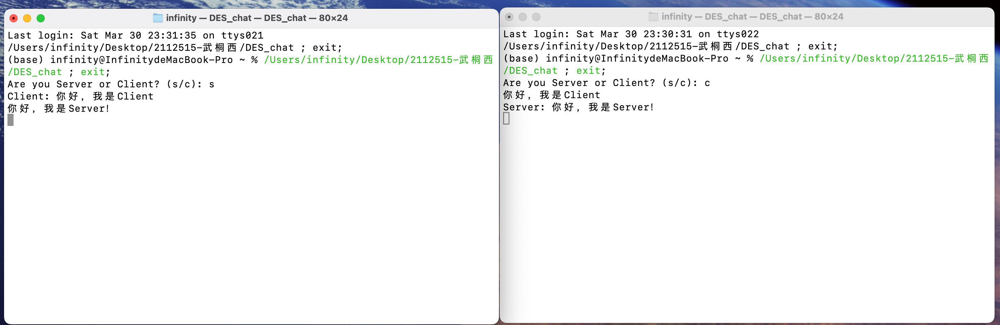
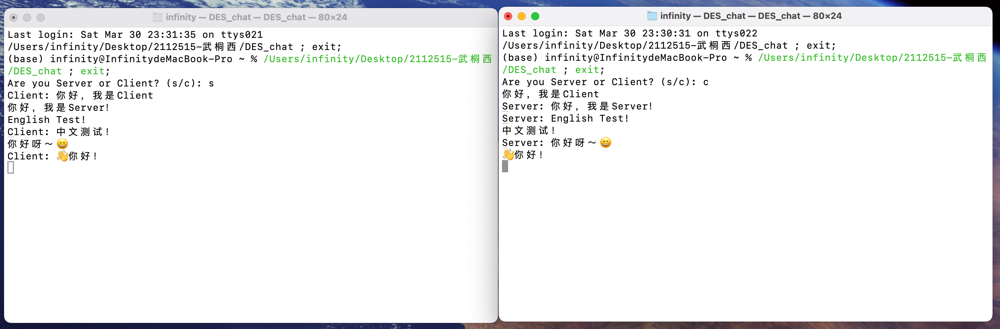

# Lab-01 基于 DES 加密的 TCP 聊天程序

<p align="center">
    
    
    
    
</p>

> 武桐西 2112515 信息安全

## Quick Start

### :tada: Multi-Platform

You can run this chat program on Linux:penguin:, MacOS:apple: and Windows:checkered_flag: .

**Prerequisite**: Please make sure that you have installed `CMake` on your machine. If not, you need to install `CMake` first.

When you are in the same directory with this `README` file, run the below command in your terminal (bash, zsh, command line, or powershell):

```sh
cmake . -B build && cmake --build build
```

Then, run the below command to execute the chat program:

```sh
cd bin
./DES_chat
```

You may choose it as server or client by inputting `s` or `c` respectively.

> [!NOTE]
>
> **NOTE** that this program now only support chat between one client and one server.

## To Do

- [x] 多平台适配
- [ ] 支持 `exit` 手动退出命令
- [ ] 多线程并发控制（原子操作）
- [ ] 缓冲区大小限制判断
- [ ] 连接成功时的空行消息的消除

## 一、实验目的与要求

1. 理解 DES 加解密的原理；
2. 理解 TCP 协议及其工作原理；
3. 掌握在某一平台下（Windows、Linux、MaxOS）下的 Socket 编程方法；
4. 利用 Socket 编写一个 TCP 聊天程序；
5. 通信的内容经过 DES 的加密与解密。

## 二、实验原理

### 2.1 DES

DES（Data Encryption Standard）是一种对称加密算法，设计于上世纪70年代初，是最早的商业加密标准之一。虽然现在已经被更安全的算法取代，但它的基本工作原理仍具有教育意义。

#### DES的基本结构和参数：

- **数据块大小**：DES以64位的数据块为单位进行加密和解密。
- **密钥长度**：DES密钥长度为56位，但实际使用中是64位，其中8位用于奇偶校验。
- **轮数**：DES使用16轮迭代的Feistel结构进行加密或解密。

#### DES的加密流程：

1. **密钥生成**：
   - 将56位的密钥扩展为64位，并根据奇偶校验位生成64位的初始密钥。
   - 将初始密钥分为左右各32位，形成左右两个子密钥。
   - 之后进行16轮子密钥生成，生成16个轮密钥。
   
2. **初始置换（IP置换）**：
   - 将64位明文根据固定的IP置换表进行置换，得到L0和R0（各32位）。

3. **迭代过程**：
   - 从第1轮到第16轮，每轮的操作如下：
     1. 将右半部分Rn作为轮函数的输入，与该轮的子密钥Kn进行混合（轮密钥生成）。
     2. 经过轮函数（包括扩展、置换、替换等操作），输出32位结果F。
     3. 将Ln与F进行异或操作，得到Rn+1；Rn+1与Ln相等，Ln+1等于Rn。

4. **逆初始置换（IP-1置换）**：
   - 将经过16轮迭代的R16和L16按照IP-1置换表进行逆置换，得到加密后的64位密文。

#### DES的解密流程：

1. **密钥生成**：与加密过程相同，生成16轮的子密钥。

2. **初始置换（IP置换）**：与加密过程相同，将64位密文进行IP置换，得到L0和R0。

3. **迭代过程**：与加密过程相同，但轮密钥的应用顺序与加密过程相反，从K16到K1。

4. **逆初始置换（IP-1置换）**：与加密过程相同，将经过16轮迭代的R16和L16按照IP-1置换表进行逆置换，得到解密后的64位明文。

#### 加密和解密过程的关键点：

- **轮函数（F函数）**：包括数据扩展、S盒替换、P盒置换等操作，用于混淆数据和增加密文的复杂性。
- **密钥扩展**：根据初始密钥生成16轮的轮密钥，用于轮函数中的密钥混合操作。
- **IP和IP-1置换**：用于打乱数据的位顺序，增加加密和解密的难度。

总的来说，DES的加密和解密过程都是通过多轮迭代和混合操作来实现的，其中密钥的生成和轮密钥的应用是关键步骤。由于现代计算能力的提高和密码分析技术的发展，DES已经不再安全，通常不建议在实际应用中使用，而应选择更安全的算法如AES来保护数据的安全性。

### 2.2 TCP

TCP（Transmission Control Protocol）是一种面向连接的、可靠的传输层协议，它在互联网协议套件中负责数据的可靠传输。下面详细介绍TCP协议的原理以及其优缺点。

#### TCP协议的原理：

1. **面向连接**：TCP是面向连接的协议，通信双方需要在传输数据之前建立连接，然后进行数据传输，最后再释放连接。

2. **可靠性**：TCP提供可靠的数据传输，通过序号、确认和重传机制确保数据的可靠性。每个数据包都有一个序号，接收方会发送确认信息，发送方如果未收到确认，则会重传数据。

3. **流量控制**：TCP使用滑动窗口协议来进行流量控制，即接收方会告知发送方自己的接收窗口大小，发送方根据窗口大小调整发送速率，以避免发送过多数据导致网络拥塞。

4. **拥塞控制**：TCP的拥塞控制机制通过慢启动、拥塞避免和快速重传等算法来避免网络拥塞和数据丢失。

5. **分段和重组**：TCP会将数据分成多个报文段进行传输，并在接收端进行重组，保证数据的完整性和正确性。

6. **超时重传**：如果发送方在一定时间内未收到确认信息，则会认为数据丢失，触发超时重传机制。

#### TCP协议的优点：

1. **可靠性**：TCP提供可靠的数据传输，保证数据的完整性和正确性。
2. **流量控制**：通过滑动窗口协议进行流量控制，避免发送过多数据导致网络拥塞。
3. **拥塞控制**：TCP的拥塞控制机制能够有效避免网络拥塞，保证网络的稳定性。
4. **顺序传输**：TCP保证数据按顺序传输，接收方可以正确重组数据。
5. **适用范围广**：TCP广泛应用于可靠传输要求较高的场景，如网页浏览、文件传输、电子邮件等。

#### TCP协议的缺点：

1. **开销大**：TCP的可靠性和流量控制机制会增加额外的开销，导致传输效率相对较低。
2. **延迟较高**：由于需要建立连接、确认数据和重传机制，TCP的延迟比UDP等协议较高。
3. **不适用于实时性要求高的应用**：由于延迟较高和开销较大，TCP不适合实时性要求较高的应用，如视频流、在线游戏等。

总的来说，TCP协议在保证数据可靠传输方面表现优秀，但在传输效率和实时性方面存在一定的缺陷，因此在设计网络应用时需要根据具体需求选择合适的传输协议。

## 三、实验平台与说明

本次实验笔者在 MacOS 平台下进行实现。

文件结构如下：

```sh
.
├── CMakeLists.txt
├── README.assets
├── README.md
├── include
│   ├── DesOp.h
│   └── chat.h
├── main.cpp
└── src
    ├── DesOp.cpp
    └── chat.cpp
```

需要注意的是，笔者的聊天程序的客户端和服务器端均集成在 `Chat` 类中，使用时依据命令行的输入 `s/c` 来决定当前程序运行的是客户端还是服务器端。



## 四、实验过程

本次实验的编程任务主要可以分为两部分：

1. DES加解密程序的编写与实现；
2. TCP聊天程序的编写与实现。

因此，本部分主要从上面两个方面来介绍。

### DES加解密

为便于后续聊天程序利用，现将DES封装成一个类，其主要成员如下：

```c++
#define get_bit(x, i) (((x) >> (i)) & 0x01)

class DesOp {
private:
    uint8_t key[8]; // 64-bit key
    uint8_t subKeys[16][6]; // 16 48-bit subkeys
    static uint8_t IP[64]; // Initial Permutation
    static uint8_t IP_INV[64]; // Inverse Initial Permutation
    static uint8_t E[48]; // Expansion Permutation (E-Box)
    static uint8_t S[8][4][16]; // S-Boxes
    static uint8_t P[32]; // Permutation (P-Box)
    static uint8_t PC1[2][28]; // Permuted Choice 1
    static uint8_t LS[16]; // Left Shifts
    static uint8_t PC2[48]; // Permuted Choice 2
    void GenerateSubKeys();
    void F(uint8_t* R, uint8_t* subKey, uint8_t* result);
    void DES(uint8_t* plainText, uint8_t* cipherText, bool isEncrypt);

    // Useful functions
    static void Xor(uint8_t* a, uint8_t* b, int length);
    static void Copy(uint8_t* a, uint8_t* b, int length);
    static void ByteToBit(uint8_t* byte, uint8_t* bit, int length);
    static void BitToByte(uint8_t* bit, uint8_t* byte, int length);
public:
    DesOp();
    ~DesOp();
    void SetKey(const char* key);
    void Encrypt(char* plainText, int plainTextLength, char*& cipherText, int& cipherTextLength);
    void Decrypt(char* cipherText, int cipherTextLength, char*& plainText, int& plainTextLength);
};
```

#### 辅助函数和宏定义

为了便于后续的加解密，首先封装一些辅助函数和宏定义：

```c++
#define get_bit(x, i) (((x) >> (i)) & 0x01)

// XOR operation (a = a XOR b)
void DesOp::Xor(uint8_t* a, uint8_t* b, int length) {
    for (int i = 0; i < length; i++) {
        a[i] ^= b[i];
    }
}

// Copy operation (a = b)
void DesOp::Copy(uint8_t* a, uint8_t* b, int length) {
    for (int i = 0; i < length; i++) {
        a[i] = b[i];
    }
}

// Convert byte array to bit array (length is in bytes)
void DesOp::ByteToBit(uint8_t* byte, uint8_t* bit, int length) {
    for (int i = 0; i < length; i++) {
        for (int j = 0; j < 8; j++) {
            bit[i * 8 + j] = get_bit(byte[i], (7 - j));
        }
    }
}

// Convert bit array to byte array (length is in bytes)
void DesOp::BitToByte(uint8_t* bit, uint8_t* byte, int length) {
    for (int i = 0; i < length; i++) {
        byte[i] = 0;
        for (int j = 0; j < 8; j++) {
            byte[i] |= bit[i * 8 + j] << (7 - j);
        }
    }
}
```

#### 子密钥生成

```c++
// Generate 16 48-bit subkeys
void DesOp::GenerateSubKeys() {
    // Permuted Choice 1
    uint8_t key_bit[64];
    ByteToBit(key, key_bit, 8);
    uint8_t key56L[28], key56R[28];
    for (int i = 0; i < 28; i++) {
        key56L[i] = key_bit[PC1[0][i] - 1];
        key56R[i] = key_bit[PC1[1][i] - 1];
    }

    // Generate 16 48-bit subkeys
    uint8_t subKey[48];
    for (int i = 0; i < 16; i++) {
        // Left Shift
        for (int j = 0; j < LS[i]; j++) {
            uint8_t tempL = key56L[0], tempR = key56R[0];
            for (int k = 0; k < 27; k++) {
                key56L[k] = key56L[k + 1];
                key56R[k] = key56R[k + 1];
            }
            key56L[27] = tempL;
            key56R[27] = tempR;
        }

        // Permuted Choice 2
        int index;
        for (int j = 0; j < 48; j++) {
            index = PC2[j] - 1;
            if (index < 28) {
                subKey[j] = key56L[index];
            } else {
                subKey[j] = key56R[index - 28];
            }
        }
        BitToByte(subKey, subKeys[i], 6);
    }
}
```

#### F函数

F函数即位16轮加解密过程中的每一轮的操作的复合：

```c++
// F function
void DesOp::F(uint8_t* R, uint8_t* subKey, uint8_t* result) {
    // Expansion Permutation
    uint8_t R_exp[48];
    for (int i = 0; i < 48; i++) {
        R_exp[i] = R[E[i] - 1];
    }

    // XOR with subKey
    Xor(R_exp, subKey, 48);

    // S-Boxes
    uint8_t S_out[32];
    for (int i = 0; i < 8; i++) {
        int row = R_exp[i * 6] * 2 + R_exp[i * 6 + 5];
        int col = R_exp[i * 6 + 1] * 8 + R_exp[i * 6 + 2] * 4 + R_exp[i * 6 + 3] * 2 + R_exp[i * 6 + 4];
        int val = S[i][row][col];
        for (int j = 0; j < 4; j++) {
            S_out[i * 4 + j] = get_bit(val, 3 - j);
        }
    }

    // Permutation
    for (int i = 0; i < 32; i++) {
        result[i] = S_out[P[i] - 1];
    }
}
```

#### DES算法

DES的加密和解密操作基本相同，唯一不同的是在解密过程中使用的子密钥的顺序与加密过程相反。

因此，可以将加密函数与解密函数封装为一个函数：

```c++
// DES operation
void DesOp::DES(uint8_t* plainText_byte, uint8_t* cipherText_byte, bool isEncrypt) {
    // Convert bytes to bits
    uint8_t plainText[64], cipherText[64];
    ByteToBit(plainText_byte, plainText, 8);
    ByteToBit(cipherText_byte, cipherText, 8);

    // Initial Permutation
    uint8_t plainText_bit[64];
    for (int i = 0; i < 64; i++) {
        plainText_bit[i] = plainText[IP[i] - 1];
    }

    // Split into L0 and R0
    uint8_t L[32], R[32];
    for (int i = 0; i < 32; i++) {
        L[i] = plainText_bit[i];
        R[i] = plainText_bit[i + 32];
    }

    // 16 rounds
    uint8_t temp[32];
    for (int i = 0; i < 16; i++) {
        Copy(temp, R, 32);
        F(R, subKeys[isEncrypt ? i : (15 - i)], R);
        Xor(R, L, 32);
        Copy(L, temp, 32);
    }

    // Combine L16 and R16
    for (int i = 0; i < 32; i++) {
        plainText_bit[i] = L[i];
        plainText_bit[i + 32] = R[i];
    }

    // Inverse Initial Permutation
    for (int i = 0; i < 64; i++) {
        cipherText[i] = plainText_bit[IP_INV[i] - 1];
    }

    // Convert bits back to bytes
    BitToByte(plainText, plainText_byte, 8); // No need for plainText
    BitToByte(cipherText, cipherText_byte, 8);
}
```

#### 分组加密明文（分组解密密文）

由于在加密或解密过程中，明文或密文需要按照64位分组进行加解密，在加密明文时若明文的长度不能被64整除，则需要进行padding操作。

由于明文的分组加密与密文的分组解密操作基本一致（除了padding操作之外），因此这里只以加密为例。

```c++
// Encrypt plainText
void DesOp::Encrypt(char* plainText, int plainTextLength, char*& cipherText, int& cipherTextLength) {
    // Padding
    int padding = 8 - plainTextLength % 8; // No matter what, padding is needed and will be used in Decrypt to remove padding
    cipherTextLength = plainTextLength + padding;
    cipherText = new char[cipherTextLength];
    for (int i = 0; i < plainTextLength; i++) {
        cipherText[i] = plainText[i];
    }
    for (int i = plainTextLength; i < cipherTextLength; i++) {
        cipherText[i] = padding; // Padding with the number of padding bytes
    }

    // Encrypt
    uint8_t plainTextBlock[8], cipherTextBlock[8];
    for (int i = 0; i < cipherTextLength; i += 8) {
        for (int j = 0; j < 8; j++) {
            plainTextBlock[j] = cipherText[i + j];
        }
        DES(plainTextBlock, cipherTextBlock, true);
        for (int j = 0; j < 8; j++) {
            cipherText[i + j] = cipherTextBlock[j];
        }
    }
}
```

> 注意⚠️：这里的padding操作并不是补零，而是填充的需要补充的字节数；同时无论明文长度是否能够被64整除，都进行padding操作，这样做的目的主要是为了在后续的解密中去除padding的内容。

### TCP聊天

TCP聊天封装类：

```c++
class Chat {
private:
    bool isServer; // Server flag
    const char* welcome_info; // Welcome information
    int serverSocket; // Server socket
    int clientSocket; // Client socket
    const char* serverIp; // Server IP
    int serverPort; // Server port
    char message[MAX_MESSAGE_LENGTH]; // Message
    char buffer[MAX_MESSAGE_LENGTH]; // Buffer
    bool isRunning; // Running flag
    std::thread receiveThread; // 新增线程对象
    DesOp des; // DES Operation
    void Init(); // Initialize
    void Connect(); // Connect to server
    void Send(); // Send message
    void ReceiveThread(); // 新增接收消息线程函数
    void Close(); // Close

public:
    Chat(); // Constructor
    ~Chat(); // Destructor
    void RunServer(); // Run Server
    void RunClient(); // Run Client
};
```

TCP这部分与上学期的计算机网络中的实验任务类似，这里不在过多赘述。

区别主要在于一些头文件等的使用（MacOS与Linux类似，与Windows系统区别较大）。

## 五、实验结果

实验结果如图所示：



可以看到程序正确的实现了DES的加密与解密，以及TCP的聊天功能。

## 六、总结与感悟

通过本次实验，我复习回顾了上学期的密码学与计算机网络的相关知识，成功地将自己的所学应用到实践当中去，体会到了“读万卷书，行万里路”，做事需要躬身实践的道理。

希望经过这学期的学习，我能够在网络安全的道路上越走越远！
