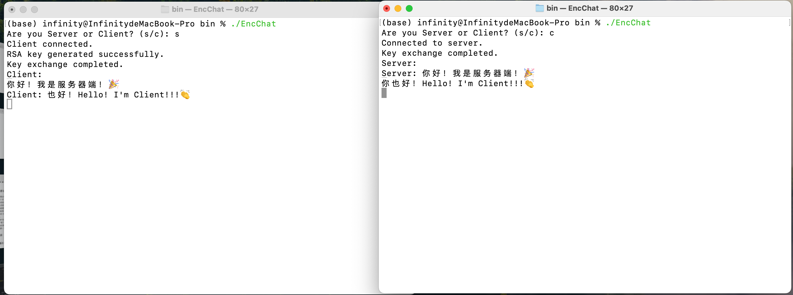
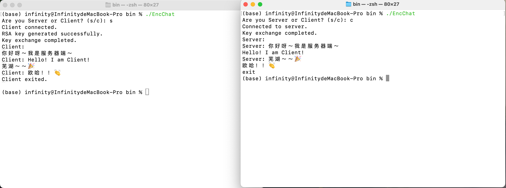
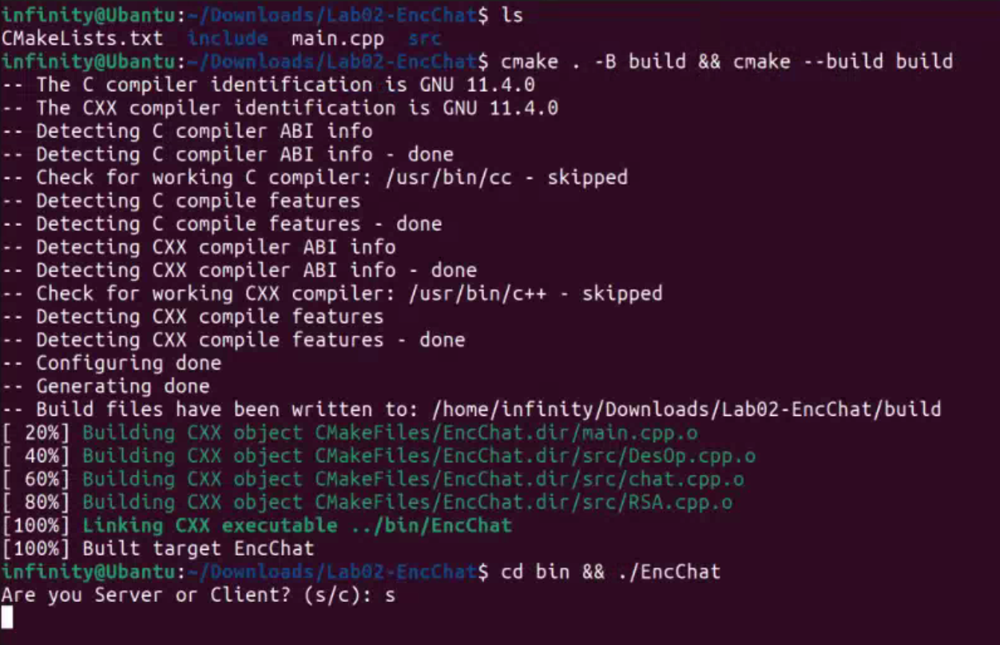
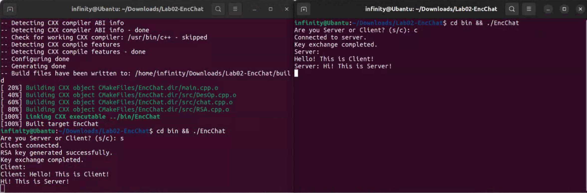
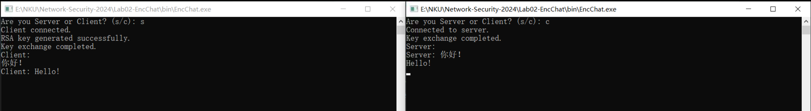

# Lab-02 基于 RSA 算法自动分配密钥的加密聊天程序

<p align="center">
    
    
    
    
</p>

> 武桐西 2112515 信息安全

## 一、实验目的与要求

本次实验在上次的 DES加密的TCP聊天程序 的基础上进行二次开发，使原有的程序可以实现全自动生成 DES 密钥以及基于 RSA 算法的密钥分配。具体要求如下：

1. 加深对 RSA 算法等公钥密码体制基本工作原理的理解。
2. 掌握基于 RSA 算法的保密通信系统的基本设计方法。
3. 完成基于 RSA 算法的保密通信程序的编写。
4. 程序必须包含 DES 密钥自动生成、RSA 密钥分配以及 DES 加密通讯三个部分。
5. 要求程序实现全双工通信，并且加密过程对用户完全透明。

## 二、实验原理

### 2.1 RSA

RSA（Rivest-Shamir-Adleman）是一种**非对称加密**算法，广泛应用于网络通信和数据安全领域。它基于大整数分解这一数论问题，其中包括两个主要步骤：密钥生成和加解密过程。

#### 密钥生成

1. **选择素数**：选择两个大素数 $ p $ 和 $ q $。
2. **计算 $ n $ 和 $ \phi(n) $**：计算 $ n = p \times q $， $ \phi(n) = (p-1) \times (q-1) $。
3. **选择公钥 $ e $**：选择一个与 $ \phi(n) $ 互质且 $ 1 < e < \phi(n) $ 的数。
4. **计算私钥 $ d $**：计算 $ d $，使得 $ e \times d \equiv 1 \pmod{\phi(n)} $，即 $ e \times d = k \times \phi(n) + 1 $ 的形式。

生成的公钥 $ (e, n) $ 用于加密，私钥 $ (d, n) $ 用于解密。

#### 加密过程

1. **转换消息**：将要加密的消息 $ M $ 转换为整数 $ m $，确保 $ 0 \leq m < n $。
2. **加密**：计算 $ C \equiv M^e \pmod{n} $。加密后的密文 $ C $ 传输给接收者。

#### 解密过程

1. **解密**：接收到密文 $ C $ 后，接收者使用私钥 $ d $ 进行解密：$ M \equiv C^d \pmod{n} $。
2. **转换回消息**：将解密得到的整数 $ M $ 转换回消息 $ m $。

RSA加解密过程的安全性基于大数分解问题的困难性，即从 $ n $ 中恢复出 $ p $ 和 $ q $ 的难度。因为 $ n $ 的长度通常为几百到几千位，目前的计算能力无法有效地分解大的合数 $ n $。

#### 应用

RSA算法作为一种非对称加密算法，具有广泛的应用领域，主要包括以下几个方面：

1. **加密通信**：RSA算法常用于保护网络通信的安全性，在协议中使用RSA算法加密数据传输，确保数据在传输过程中不被窃取或篡改。
2. **数字签名**：RSA算法也常用于数字签名领域，通过私钥对消息进行签名，接收者使用公钥验证签名的有效性，确保消息的完整性和来源可信。
3. **身份认证**：RSA算法可以用于身份认证机制，如在数字证书中使用RSA算法对证书进行签名，验证证书的真实性和合法性，确保通信双方的身份是可信的。
4. **访问控制**：在系统安全领域，RSA算法可以用于访问控制机制，如加密存储访问控制列表（ACL），确保只有授权用户能够访问受保护的资源。
5. **支付安全**：在线支付系统常使用RSA算法进行支付信息的加密和数字签名，保护用户的支付数据不被恶意攻击者获取或篡改。
6. **数据加密**：除了通信外，RSA算法也可用于对本地数据进行加密存储，如加密文件、加密数据库等，保护数据在存储和传输过程中的安全性。

总体而言，RSA算法在信息安全领域发挥着重要作用，为保护数据的安全性、完整性和可信性提供了有效的加密和认证手段。

### 2.2 DES

DES（Data Encryption Standard）是一种对称加密算法，设计于上世纪70年代初，是最早的商业加密标准之一。虽然现在已经被更安全的算法取代，但它的基本工作原理仍具有教育意义。

#### DES的基本结构和参数：

- **数据块大小**：DES以64位的数据块为单位进行加密和解密。
- **密钥长度**：DES密钥长度为56位，但实际使用中是64位，其中8位用于奇偶校验。
- **轮数**：DES使用16轮迭代的Feistel结构进行加密或解密。

#### DES的加密流程：

1. **密钥生成**：
   - 将56位的密钥扩展为64位，并根据奇偶校验位生成64位的初始密钥。
   - 将初始密钥分为左右各32位，形成左右两个子密钥。
   - 之后进行16轮子密钥生成，生成16个轮密钥。

2. **初始置换（IP置换）**：
   - 将64位明文根据固定的IP置换表进行置换，得到L0和R0（各32位）。

3. **迭代过程**：
   - 从第1轮到第16轮，每轮的操作如下：
     1. 将右半部分Rn作为轮函数的输入，与该轮的子密钥Kn进行混合（轮密钥生成）。
     2. 经过轮函数（包括扩展、置换、替换等操作），输出32位结果F。
     3. 将Ln与F进行异或操作，得到Rn+1；Rn+1与Ln相等，Ln+1等于Rn。

4. **逆初始置换（IP-1置换）**：
   - 将经过16轮迭代的R16和L16按照IP-1置换表进行逆置换，得到加密后的64位密文。

#### DES的解密流程：

1. **密钥生成**：与加密过程相同，生成16轮的子密钥。

2. **初始置换（IP置换）**：与加密过程相同，将64位密文进行IP置换，得到L0和R0。

3. **迭代过程**：与加密过程相同，但轮密钥的应用顺序与加密过程相反，从K16到K1。

4. **逆初始置换（IP-1置换）**：与加密过程相同，将经过16轮迭代的R16和L16按照IP-1置换表进行逆置换，得到解密后的64位明文。

#### 加密和解密过程的关键点：

- **轮函数（F函数）**：包括数据扩展、S盒替换、P盒置换等操作，用于混淆数据和增加密文的复杂性。
- **密钥扩展**：根据初始密钥生成16轮的轮密钥，用于轮函数中的密钥混合操作。
- **IP和IP-1置换**：用于打乱数据的位顺序，增加加密和解密的难度。

总的来说，DES的加密和解密过程都是通过多轮迭代和混合操作来实现的，其中密钥的生成和轮密钥的应用是关键步骤。由于现代计算能力的提高和密码分析技术的发展，DES已经不再安全，通常不建议在实际应用中使用，而应选择更安全的算法如AES来保护数据的安全性。

### 2.3 TCP

TCP（Transmission Control Protocol）是一种面向连接的、可靠的传输层协议，它在互联网协议套件中负责数据的可靠传输。下面详细介绍TCP协议的原理以及其优缺点。

#### TCP协议的原理：

1. **面向连接**：TCP是面向连接的协议，通信双方需要在传输数据之前建立连接，然后进行数据传输，最后再释放连接。

2. **可靠性**：TCP提供可靠的数据传输，通过序号、确认和重传机制确保数据的可靠性。每个数据包都有一个序号，接收方会发送确认信息，发送方如果未收到确认，则会重传数据。

3. **流量控制**：TCP使用滑动窗口协议来进行流量控制，即接收方会告知发送方自己的接收窗口大小，发送方根据窗口大小调整发送速率，以避免发送过多数据导致网络拥塞。

4. **拥塞控制**：TCP的拥塞控制机制通过慢启动、拥塞避免和快速重传等算法来避免网络拥塞和数据丢失。

5. **分段和重组**：TCP会将数据分成多个报文段进行传输，并在接收端进行重组，保证数据的完整性和正确性。

6. **超时重传**：如果发送方在一定时间内未收到确认信息，则会认为数据丢失，触发超时重传机制。

#### TCP协议的优点：

1. **可靠性**：TCP提供可靠的数据传输，保证数据的完整性和正确性。
2. **流量控制**：通过滑动窗口协议进行流量控制，避免发送过多数据导致网络拥塞。
3. **拥塞控制**：TCP的拥塞控制机制能够有效避免网络拥塞，保证网络的稳定性。
4. **顺序传输**：TCP保证数据按顺序传输，接收方可以正确重组数据。
5. **适用范围广**：TCP广泛应用于可靠传输要求较高的场景，如网页浏览、文件传输、电子邮件等。

#### TCP协议的缺点：

1. **开销大**：TCP的可靠性和流量控制机制会增加额外的开销，导致传输效率相对较低。
2. **延迟较高**：由于需要建立连接、确认数据和重传机制，TCP的延迟比UDP等协议较高。
3. **不适用于实时性要求高的应用**：由于延迟较高和开销较大，TCP不适合实时性要求较高的应用，如视频流、在线游戏等。

总的来说，TCP协议在保证数据可靠传输方面表现优秀，但在传输效率和实时性方面存在一定的缺陷，因此在设计网络应用时需要根据具体需求选择合适的传输协议。

## 三、实验平台与运行说明

### :tada: Multi-Platform

本次实验利用**条件编译**实现了**跨平台**，支持 Linux平台、MacOS平台以及 WIndows平台等。

可以使用 `CMake` 进行构建。

> 实验代码已在 [GitHub](https://github.com/InfinityUniverse0/Network-Security-2024) 上传，计划于学期结束后开源。

#### Quick Start

You can run this chat program on Linux:penguin:, MacOS:apple: and Windows:checkered_flag: .

**Prerequisite**: Please make sure that you have installed `CMake` on your machine. If not, you need to install `CMake` first.

When you are in the same directory with this `README` file, run the below command in your terminal (bash, zsh, command line, or powershell):

```sh
cmake . -B build && cmake --build build
```

Then, run the below command to execute the chat program:

```sh
cd bin
./EncChat
```

You may choose it as server or client by inputting `s` or `c` respectively.

> [!NOTE]
>
> **NOTE** that this program now only support chat between one client and one server.

> [!WARNING]
>
> In Windows Platform, MSVC does **NOT** suggest 128-bit integer. You can use MinGW-w64 instead.

### 文件结构

本次实验的文件结构如下：

```sh
.
├── CMakeLists.txt
├── bin
│   └── EncChat // Excutable
├── include
│   ├── DesOp.h
│   ├── RSA.h
│   └── chat.h
├── main.cpp
└── src
    ├── DesOp.cpp
    ├── RSA.cpp
    └── chat.cpp
```

你可以使用 `CMake` 进行构建，从而进行编译并生成你对应的平台的可执行文件 `EncChat` 。

需要注意的是，笔者的聊天程序的客户端和服务器端均集成在 `Chat` 类中，使用时依据命令行的输入 `s/c` 来决定当前程序运行的是客户端还是服务器端。



## 四、实验过程

本次实验中在上一次实验的基础上进行二次开发，**增加**的内容主要有：

1. RSA算法部分，实现RSA的密钥生成以及加密与解密；
2. 基于RSA实现DES对称加密密钥的安全交换。

因此，本次实验主要介绍上面的新增部分。

### RSA公钥密码体制

将RSA公钥密码体制封装为类，如下：

```c++
class RSA {
private:
    uint64_t p; // Prime number p
    uint64_t q; // Prime number q
    uint64_t n; // n = p * q
    uint64_t phi; // Euler's totient function
    uint64_t e; // Public key e
    uint64_t d; // Private key d

    static uint64_t ModExp(uint64_t base, uint64_t exp, uint64_t mod); // Modular exponentiation
    static uint64_t ModInv(uint64_t a, uint64_t m); // Modular inverse
    static bool MillerRabin(uint64_t n, int round = 50); // Miller-Rabin primality test

public:
    RSA();
    ~RSA();
    bool GenerateKey(); // Generate public and private keys
    inline uint64_t GetPublicKey() {return e;}; // Get public key
    inline uint64_t GetModulus() {return n;}; // Get modulus
    static uint64_t Encrypt(uint32_t plainText, uint64_t e, uint64_t n); // Encrypt
    uint32_t Decrypt(uint64_t cipherText); // Decrypt
};
```

其中，RSA体制主要的参数有：

1. `p` `q` ：均为大素数；
2.  `n` ：$n = p \times q$ ；
3. `phi` ：$\varphi(n) = (p-1) \times (q-1)$ ；
4. `e` ：$ \gcd(e, \varphi(n)) = 1, \, 1 < e < \varphi(n) $ ；
5. `d` ：$ d \equiv e^{-1} \mod \varphi(n) $ 即 $ e \cdot d \equiv 1 \mod \varphi(n) $ 。

在RSA中，关键的操作主要有：

1. **模幂运算**：使用 **平方-乘** 算法进行快速模幂运算。
2. **乘法逆元**：利用扩展的欧几里得算法实现求乘法逆元。
3. **素性检测**：采用 Miller-Rabin 算法进行素性检测（概率性算法）。

> ⚠️ 注意
>
> 本次实验中，为了演示以及便于编程实现，将RSA算法的密钥长度设置为 64 位，而不是从安全性角度出发使用常用且较为安全的 2048 位等。
>
> 在代码实现过程中，为了解决溢出问题，在过程中有些地方采用了 128 位整数，这不包含在C++标准中，但是许多常见的编译器均支持，如G++、Clang等。
>
> 若要实现 2048 位密钥的RSA算法，需要用到第三方的大整数运算库，比如 GMP 库等（需要额外下载）。

#### 模幂运算

**平方-乘算法**（Square-and-Multiply Algorithm）是一种用于快速计算大数的幂的算法，特别适用于模指数运算，如 $ a^b \mod{n} $ 的计算，其中 $ a $ 和 $ b $ 都是大整数，而且 $ n $ 也是一个较大的数。其基本思想是利用二进制形式的指数 $ b $ 来加速幂运算的计算过程。

##### 平方-乘算法的步骤

1. **将指数 $ b $ 转换为二进制形式**：将指数 $ b $ 表示为二进制形式，例如 $ b = (b_{k-1}b_{k-2}...b_1b_0)_2 $。
2. **初始化**：将结果 $ result $ 初始化为 1，设置 $ x = a $。
3. **从高位到低位遍历二进制指数 $ b $**：
   - 若 $ b_i = 1 $，则将 $ result $ 乘以 $ x $ 并取模 $ n $，即 $ result = (result \times x) \mod{n} $。
   - 将 $ x $ 平方并取模 $ n $，即 $ x = (x^2) \mod{n} $。
4. **重复步骤 3 直到遍历完整个二进制指数 $ b $ **。

##### 平方-乘算法的思想

- **二进制形式的指数化简计算**：通过将指数 $ b $ 转换为二进制形式，可以将指数化简为一系列平方和乘法操作，从而减少了乘法的次数，提高了计算效率。
- **平方操作的利用**：通过平方操作 $ x = (x^2) \mod{n} $ 可以快速得到 $ x $ 的平方，避免了多次乘法运算的开销。
- **模运算的优化**：在每一步的乘法操作后都进行取模 $ n $ 的运算，保证结果在较小范围内，避免了溢出问题和大数运算的复杂性。

平方-乘算法在计算大数的幂时具有较高的效率和可靠性，特别适用于密码学中的加密算法和数字签名等场景中对大数的快速运算要求。

采用 **平方-乘** 算法进行快速模幂运算，其代码如下：

```c++
uint64_t RSA::ModExp(uint64_t base, uint64_t exp, uint64_t mod) {
    // Use the square-and-multiply algorithm
    base = base % mod;
    uint64_t idx = (1LL << 63);
    while (!(exp & idx)) {
        idx >>= 1;
    }

    uint128_t result = 1; // In case of overflow
    while (idx) {
        result = (uint128_t)((result * result) % mod);
        if (exp & idx) {
            result = (uint128_t)((result * base) % mod);
        }
        idx >>= 1;
    }

    return (uint64_t)result;
}
```

⚠️ **注意**：在中间结果中，采用了 128 位的无符号整数，以防止出现益处问题。

> 128位整数不包含在C++标准中，但是许多常见的编译器均支持，如G++、Clang等。此后不再赘述。

#### 乘法逆元

由于 $e$ 与 $d$ 互为乘法逆元，即 $ e \cdot d \equiv 1 \mod \varphi(n) $ ，因此根据 $e$ 求 $d$ 即为求 $e$ 模 $\varphi(n)$ 的乘法逆元 $ d \equiv e^{-1} \mod \varphi(n) $ 。

**扩展欧几里得算法**（Extended Euclidean Algorithm）是一种用于求解两个整数 $ a $ 和 $ b $ 的最大公约数（最大公因数）以及求解贝祖等式 $ ax + by = \gcd(a, b) $ 中 $ x $ 和 $ y $ 的整数解的算法。它是欧几里得算法的扩展形式，主要用于解决线性同余方程、模逆元等问题。

##### 扩展欧几里得算法的步骤

1. **初始化**：将 $ a $ 和 $ b $ 初始化为输入的两个整数，设置 $ x_1 = 1, y_1 = 0, x_2 = 0, y_2 = 1 $。
2. **迭代计算**：重复以下步骤直到 $ b $ 为 0：
   - 计算商 $ q $ 和余数 $ r $：$ q = \lfloor a / b \rfloor, r = a \mod b $。
   - 更新 $ a $ 和 $ b $ 的值：$ a = b, b = r $。
   - 更新 $ x_1, y_1, x_2, y_2 $ 的值：$ x_1 = x_2, y_1 = y_2, x_2 = x_1 - q \times x_2, y_2 = y_1 - q \times y_2 $。
3. **输出结果**：当 $ b $ 变为 0 时，$ a $ 即为 $ \gcd(a, b) $，而 $ x_1 $ 和 $ y_1 $ 即为贝祖等式 $ ax + by = \gcd(a, b) $ 的整数解。

##### 扩展欧几里得算法的思想

- **递归关系**：扩展欧几里得算法通过不断地利用欧几里得算法中的递归关系 $ \gcd(a, b) = \gcd(b, a \mod b) $ 来求解最大公约数，同时记录每一步的辅助系数 $ x $ 和 $ y $。
- **反向推导**：从欧几里得算法的反向推导出发，利用辅助系数 $ x $ 和 $ y $ 的递推关系，可以在每一步的计算中更新这两个系数，最终得到贝祖等式的整数解。
- **模逆元求解**：扩展欧几里得算法中的 $ x $ 和 $ y $ 的整数解 $ ax + by = \gcd(a, b) $ 可以用于求解模逆元问题，即 $ ax \equiv 1 \pmod{b} $ 的解为 $ x $。

扩展欧几里得算法在密码学中常用于求解模逆元、解决线性同余方程、计算最大公约数等问题，具有较高的实用价值和广泛的应用场景。

在这里采用扩展的欧几里得算法进行快速求解。其代码如下：

```c++
uint64_t RSA::ModInv(uint64_t a, uint64_t m) {
    // Use the extended Euclidean algorithm
    /*
     * The extended Euclidean algorithm finds the modular multiplicative inverse of a modulo m.
     * If a and m are coprime, then a^(-1) mod m exists and the function returns the modular multiplicative inverse of a modulo m.
     * If a and m are not coprime, then a^(-1) mod m does not exist and the function returns 0.
     */

    assert(a < m); // Ensure a < m

    // NOTE: Use signed integer for that the result may be negative; use 128-bit integer to avoid overflow
    int128_t r0 = m, r = a; // Remainder sequence
    int128_t q = -1; // Quotient sequence
    int128_t s0 = 1, s = 0;
    int128_t t0 = 0, t = 1;

    while (r0 % r) { // If the remainder is not 0, continue the loop
        int128_t tmp = r0;
        r0 = r;
        r = tmp % r0;

        q = tmp / r0;

        tmp = s0;
        s0 = s;
        s = tmp - s0 * q;

        tmp = t0;
        t0 = t;
        t = tmp - t0 * q;
    }

    if (r == 1) { // If a and m are coprime, then a^(-1) mod m exists
        // Ensure the result is positive
        if (s < 0)
            s += a;
        if (t < 0)
            t += m;
        return t;
    }

    return 0; // a and m are not coprime, then a^(-1) mod m does not exist
}
```

⚠️ 需要注意的是：扩展的欧几里得算法同样包含原有的欧几里得求**最大公约数**算法的步骤，而当二者的最大公约数为 $1$ 时（即二者互素时），乘法逆元**存在**，并可以根据扩展欧几里得算法求出；而当二者的最大公约数不为 $1$ 时（即二者不互素时），乘法逆元**不存在**，在代码中设置该种情况的函数返回值为 $0$ 。

#### 素性检测

**Miller-Rabin素性检测算法**是一种用于确定一个数是否为素数的概率性算法。它基于**费马小定理**和**二次探测原理**，具有较高的效率和可靠性，特别适用于大数的素性检测。

##### Miller-Rabin素性检测算法的步骤

1. **选择待检测的数 $ n $**：选择一个大于2的奇数 $ n $，作为待检测的数。
2. **确定 $ n-1 $ 的因式分解 $ n-1 = 2^s \times d $**：将 $ n-1 $ 进行因式分解，其中 $ s $ 是非负整数， $ d $ 是奇数。
3. **选择随机整数 $ a $**：选择一个介于 2 和 $ n-2 $ 之间的随机整数 $ a $。
4. **计算 $ a^d \mod{n} $**：计算 $ a^d \mod{n} $ 的值。
5. **进行二次探测**：若 $ a^d \mod{n} = 1 $ 或 $ a^d \mod{n} = n-1 $，则 $ n $ 可能是素数，进行下一轮检测。否则，继续进行下一步。
6. **重复二次探测 $ s-1 $ 次**：对 $ a^{2^r \times d} \mod{n} $ 进行 $ s-1 $ 次二次探测，其中 $ r $ 从 1 到 $ s-1 $。
7. **判断 $ n $ 的素性**：若所有二次探测都满足 $ a^{2^r \times d} \mod{n} \neq n-1 $，则 $ n $ 为合数；否则， $ n $ 可能为素数。

##### Miller-Rabin素性检测算法的思想

- **二次探测原理**：Miller-Rabin素性检测算法基于二次探测原理，通过多次二次探测 $ a^{2^r \times d} \mod{n} $ 的值来判断 $ n $ 是否为素数。若存在一个 $ a $ 使得 $ a^d \mod{n} \neq 1 $ 且 $ a^{2^r \times d} \mod{n} \neq n-1 $，则 $ n $ 为合数；否则， $ n $ 可能为素数。
- **费马小定理**：Miller-Rabin素性检测算法的核心思想之一是利用费马小定理 $ a^{p-1} \equiv 1 \pmod{p} $，其中 $ p $ 是素数，来进行初步判断。如果 $ n $ 通过了多次二次探测，说明它不大可能是合数。
- **概率性算法**：需要注意的是，Miller-Rabin素性检测算法是一种**概率性算法**，其结果是有一定概率的正确性。因此，在实际应用中通常会进行多轮检测来增加准确性。

Miller-Rabin素性检测算法在实际应用中被广泛使用，特别是在密码学和数字算法中，用于判断大数的素性。虽然是概率性算法，但其准确性和效率得到了广泛认可。

采用 Miller-Rabin 算法进行素性检测。

```c++
bool RSA::MillerRabin(uint64_t n, int round) {
    if (n == 2) return true;
    if (n < 2 || (n & 1) == 0) return false;

    // Write n as 2^k * m + 1
    uint64_t m = n - 1;
    uint64_t k = 0;
    while ((m & 1) == 0) {
        m >>= 1;
        k++;
    }

    std::random_device rd;
    std::mt19937 gen(rd());
    std::uniform_int_distribution<uint64_t> dis(2, n - 1);

    while (round--) { // Loop `round` times
        uint64_t a = dis(gen); // random init: [2, n-1]
        uint64_t b = ModExp(a, m, n);
        if (b == 1 || b == n - 1) continue;

        for (int i = 0; i < k; i++) {
            b = ModExp(b, 2, n);
            if ((b == n - 1) && (i < k - 1)) {
                b = 1;
                break;
            }
            if (b == 1) return false;
        }

        if (b != 1) return false; // Failed Fermat test
    }
    return true;
}
```

注意到这是一个**概率性算法**，因此需要多次重复以保证出错的概率处在可接受的极小的范围内。

### RSA密钥生成

```c++
bool RSA::GenerateKey() {
    // Generate prime numbers p and q
    std::random_device rd;
    std::mt19937 gen(rd());
    std::uniform_int_distribution<uint64_t> dis(0x20000000, 0xFFFFFFFF); // [2^29, 2^32-1]

    const int MAX_ROUND = 50;
    do {
        p = dis(gen);
    } while (!MillerRabin(p, MAX_ROUND));

    do {
        q = dis(gen);
    } while (!MillerRabin(q, MAX_ROUND));

    n = p * q;
    phi = (p - 1) * (q - 1);

    // Generate public key e
    /*
     * The public key e must be coprime with phi(n) and 1 < e < phi(n).
     * Because phi(n) is even, e is odd.
     * The public key e is commonly set to 65537 (2^16 + 1) because it is prime and has a short binary representation with only two bits set.
     */
    e = 65537; // Commonly used public key
    while (e < phi) {
        // if ((d = ModInv(e, phi))) { break;}

        /*
         * Below we use a more efficient way to find e
         * Here we let e:
         * 1. e is odd
         * 2. e is not a factor of phi
         * 3. e is prime
         * NOTE: This is a more strict condition than the original one
         * You can also use the original one to find e with a higher complexity by using the above code
         */
        if ((phi % e != 0) && (MillerRabin(e, MAX_ROUND))) {
            break;
        }
        e += 2; // Ensure e is odd
    }

    if (e >= phi) {
        // Failed to find e
        // Reset the key
        p = 0; q = 0; n = 0; phi = 0; e = 0; d = 0;
        return false;
    }

    d = ModInv(e, phi);
    return true;
}
```

>  ⚠️ 注意
>
> 在RSA的密钥生成时，采用常用的65537作为e的初始值，并以此为基础生成符合要求的e。
>
> 这里采用了一种更为有效的选取e的方式：
>
> 1. e为奇数
> 2. e不是 $\varphi(n)$ 的因子
> 3. e是素数
>
> 需要注意的是，这一要求比正常e的要求更加严格。
>
> 该代码注释的上方给出了常规的e的选取方法。

### RSA加密与解密

根据前面的介绍，RSA的加密与解密过程其实就是执行一次模幂运算。

```c++
uint64_t RSA::Encrypt(uint32_t plainText, uint64_t e, uint64_t n) {
    return ModExp((uint64_t)plainText, e, n);
}
```

```c++
uint32_t RSA::Decrypt(uint64_t cipherText) {
    return (uint32_t)ModExp(cipherText, d, n);
}
```

### 密钥安全交换

利用 RSA 进行 DES 密钥的安全交换，然后基于 DES 进行聊天内容的加密与解密。

这部分的流程如下：

1. 服务器端生成 RSA 公钥与私钥对
2. 服务器端向客户端发送 RSA 公钥（可在不安全信道）
3. 客户端生成 DES 密钥
4. 客户端接受服务器端发送的 RSA 公钥，并用其加密 DES 密钥，而后将加密后的 DES 密钥发送给服务器端
5. 服务器端接受加密的 DES 密钥，用自己的 RSA 私钥解密
6. ✅ 服务器端与客户端完成密钥的安全交换

#### 服务器端 Server

Server的主要工作：

1. 生成 RSA 公钥与私钥对（该过程可能失败，本实验中设置重复三次，三次均失败后即退出，但是概率极低）
2. 向客户端发送公钥
3. 接受客户端发送的加密后的 DES 密钥
4. 使用 RSA 私钥解密
5. 设置 DES 密钥

```c++
/* ==================== Key Exchange Begin ==================== */
// Generate RSA Keys
const int N_RETRY = 3; // Number of retries for RSA key generation
for (int i = 0; i < N_RETRY; i++) {
    if (rsa.GenerateKey()) {
        std::cout << "RSA key generated successfully." << std::endl;
        break;
    }

    if (i == N_RETRY - 1) {
        std::cerr << "Error: Failed to generate RSA key." << std::endl;
        std::cerr << "Server Exiting..." << std::endl;
        return;
    } else {
        std::cerr << "Warning: Failed to generate RSA key. Retrying..." << std::endl;
    }
}

// Send public key and modulus
uint64_t e = rsa.GetPublicKey();
uint64_t n = rsa.GetModulus();
if (send(clientSocket, &e, sizeof(e), 0) < 0) {
    std::cerr << "Error: Failed to send public key." << std::endl;
    return;
}
if (send(clientSocket, &n, sizeof(n), 0) < 0) {
    std::cerr << "Error: Failed to send modulus." << std::endl;
    return;
}

// Receive DES key from client
uint64_t desKey_enc[8];
if (recv(clientSocket, desKey_enc, sizeof(desKey_enc), 0) < 0) {
    std::cerr << "Error: Failed to receive DES key." << std::endl;
    return;
}

// Decrypt DES key using RSA private key
uint8_t desKey[8];
for (int i = 0; i < 8; i++) {
    desKey[i] = rsa.Decrypt(desKey_enc[i]);
}

// Set DES key
des.SetKey((char*)desKey);

std::cout << "Key exchange completed." << std::endl;
/* ===================== Key Exchange End ===================== */
```

#### 客户端 Client

Client的主要工作：

1. 生成 DES 密钥
2. 接受服务器发送的 RSA 公钥
3. 利用 RSA 公钥对 DES 密钥进行加密
4. 将加密后的 DES 密钥发送给服务器

```c++
/* ==================== Key Exchange Begin ==================== */
// Generate DES key
des.RandomGenKey();
uint8_t* desKey;
desKey = des.GetKey();

// Receive RSA public key and modulus from server
uint64_t e, n;
if (recv(clientSocket, &e, sizeof(e), 0) < 0) {
    std::cerr << "Error: Failed to receive public key." << std::endl;
    return;
}
if (recv(clientSocket, &n, sizeof(n), 0) < 0) {
    std::cerr << "Error: Failed to receive modulus." << std::endl;
    return;
}

// Encrypt DES key using RSA public key
uint64_t desKey_enc[8];
for (int i = 0; i < 8; i++) {
    desKey_enc[i] = RSA::Encrypt((uint32_t)desKey[i], e, n);
}
delete[] desKey; // Release memory

// Send DES key to server
if (send(clientSocket, desKey_enc, sizeof(desKey_enc), 0) < 0) {
    std::cerr << "Error: Failed to send DES key." << std::endl;
    return;
}

std::cout << "Key exchange completed." << std::endl;
/* ===================== Key Exchange End ===================== */
```

### DES加密通信

本部分内容与上次实验基本相同，这里不在赘述。

相关的接口如下：

```c++
#include <cstdint> // uint8_t
#include <random> // Generate random number

#define get_bit(x, i) (((x) >> (i)) & 0x01)

class DesOp {
private:
    uint8_t key[8]; // 64-bit key
    uint8_t subKeys[16][6]; // 16 48-bit subkeys
    static uint8_t IP[64]; // Initial Permutation
    static uint8_t IP_INV[64]; // Inverse Initial Permutation
    static uint8_t E[48]; // Expansion Permutation (E-Box)
    static uint8_t S[8][4][16]; // S-Boxes
    static uint8_t P[32]; // Permutation (P-Box)
    static uint8_t PC1[2][28]; // Permuted Choice 1
    static uint8_t LS[16]; // Left Shifts
    static uint8_t PC2[48]; // Permuted Choice 2
    void GenerateSubKeys();
    void F(uint8_t* R, uint8_t* subKey, uint8_t* result);
    void DES(uint8_t* plainText, uint8_t* cipherText, bool isEncrypt);

    // Useful functions
    static void Xor(uint8_t* a, uint8_t* b, int length);
    static void Copy(uint8_t* a, uint8_t* b, int length);
    static void ByteToBit(uint8_t* byte, uint8_t* bit, int length);
    static void BitToByte(uint8_t* bit, uint8_t* byte, int length);
public:
    DesOp();
    ~DesOp();
    void RandomGenKey(); // Generate a random key
    uint8_t* GetKey(); // Get key
    void SetKey(const char* key);
    void Encrypt(char* plainText, int plainTextLength, char*& cipherText, int& cipherTextLength);
    void Decrypt(char* cipherText, int cipherTextLength, char*& plainText, int& plainTextLength);
};
```

### TCP聊天

本部分内容与上次实验基本相同，区别在于这里增加了密钥生成（RSA与DES）与密钥（DES）安全交换的过程。这里不在赘述。

相关的接口如下：

```c++
#ifdef _WIN32
    #include <winsock2.h>
    #define close(s) closesocket(s)
    typedef SSIZE_T ssize_t;
    typedef int socklen_t;
#else
    #include <sys/socket.h> // socket
    #include <arpa/inet.h>
    #include <unistd.h>
#endif

#include <thread> // thread
#include <atomic> // atomic
#include "DesOp.h" // DES Operation
#include "RSA.h" // RSA

#define DEFAULT_SERVER_IP "127.0.0.1" // Default server IP
#define DEFAULT_SERVER_PORT 8888 // Default server port
#define MAX_MESSAGE_LENGTH 512 // Maximum message length
#define EXIT_COMMAND "exit" // Exit command

class Chat {
private:
    bool isServer; // Server flag
    int serverSocket; // Server socket
    int clientSocket; // Client socket
    const char* serverIp; // Server IP
    int serverPort; // Server port
    char message[MAX_MESSAGE_LENGTH]; // Message
    char buffer[MAX_MESSAGE_LENGTH]; // Buffer
    std::atomic<bool> isRunning; // Running flag
    std::atomic<bool> exited; // Exited flag
    std::thread receiveThread; // Receive message thread object
    DesOp des; // DES Operation
    RSA rsa; // RSA
    void Init(); // Initialize
    void Connect(); // Connect to server (Only for client)
    void Send(); // Send message
    void ReceiveThread(); // Receive message thread function
    void Close(); // Close

public:
    Chat(); // Constructor
    ~Chat(); // Destructor
    void RunServer(); // Run Server
    void RunClient(); // Run Client
};
```

### 其他事项

本实验中，出了前面的要求之外，还实现了：

- 采用条件编译实现**多平台**（Multi-Platform）
- 采用了 `CMake` 构建系统
- 支持 `exit` 手动退出命令
- 利用原子操作实现多线程并发控制（多线程安全）

## 五、实验结果

本次实验可以跨平台。

> ⚠️ 注意：本实验中所提交的程序为 Linux 下的可执行文件。

### MacOS系统



可以看到，程序能够正确实现：

1. 基于RSA的DES密钥安全交换
2. DES加密通信（中文、英文、其他字符、emoji😄等）
3. 手动程序退出 `exit`

因此本次实验非常成功！

### Linux系统





### Windows系统



> ⚠️ 注意
>
> MSVC编译器不支持 128 位整数，这里笔者采用的是MinGW-w64。

## 六、总结与感悟

本次实验，笔者实现了基于 RSA 的 DES 密钥安全交换，以及 DES 加密的 TCP 通信聊天，实验非常成功！

通过本次实验，我复习回顾了上学期的密码学与计算机网络的相关知识，成功地将自己的所学应用到实践当中去，体会到了“读万卷书，行万里路”，做事需要躬身实践的道理。

希望经过这学期的学习，我能够在网络安全的道路上越走越远！
