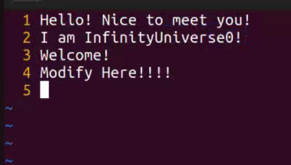

# Lab-03 基于 MD5 算法的文件完整性校验程序

<p align="center">
    
    
    
    
</p>

> 武桐西 2112515 信息安全

## 一、实验目的与要求

本次实验要求实现基于 MD5 算法的文件完整性校验程序。

实验目的如下：

1. 深入理解 MD5 算法的基本原理。
2. 掌握利用 MD5 算法生成数据摘要的所有计算过程。
3. 掌握 Linux 系统中检测文件完整性的基本方法。
4. 熟悉 Linux 系统中文件的基本操作方法。

实验要求如下：

1. 准确地实现 MD5 算法的完整计算过程。
2. 对于任意长度的字符串能够生成 128 位 MD5 摘要。
3. 对于任意大小的文件能够生成 128 位 MD5 摘要。
4. 通过检查 MD5 摘要的正确性来检验原文件的完整性。

## 二、实验原理

MD5（Message Digest Algorithm 5）是一种常用的哈希函数，用于计算数据的摘要或消息认证码。它将任意长度的输入数据（例如文本、文件等）转换为固定长度（128位）的哈希值，通常以十六进制表示。MD5广泛用于验证文件完整性、数字签名等安全领域。

MD5算法的步骤如下：

1. **填充消息**：首先，将消息填充至长度模 512 与 448 同余，通常使用位填充（padding）的方式，在消息末尾添加一个比特 1，然后添加 0 直到填至 418 mod 512。

2. **添加长度**：在填充后的消息末尾，添加一个 64 位的整数，表示原始消息的长度，这样总消息长度就成为 512 位的倍数。

3. **初始化变量**：定义四个 32 位的寄存器 A、B、C、D，并初始化为固定的常量，作为算法的初始状态。

4. **处理消息**：将填充后的消息按 512 位分组，每组作为一个处理单元。对每个处理单元进行四轮的循环操作。

5. **输出结果**：经过处理所有消息块后，将最终的寄存器值连接起来，即得到 128 位的 MD5 哈希值。

MD5算法的特点包括：

- **固定长度输出**：无论输入数据的长度如何，MD5总是生成一个固定长度的128位哈希值。

- **不可逆性**：难以从哈希值反推出原始输入数据，因此MD5是单向函数。

- **强抗碰撞性**：已知原数据和其MD5值，想找到一个具有相同MD5值的数据（即伪造数据）是非常困难的。

  MD5存在碰撞风险，即两个不同的输入数据可能生成相同的哈希值，尽管这种情况在实际中并不常见。

  > ⚠️ 中国密码学家王小云院士提出了快速寻找一对MD5碰撞的方法，可以快速寻找两对消息，使其MD5值相同。

- **速度快**：相对于一些其他哈希算法，MD5的计算速度比较快。

文件完整性校验则是利用MD5或其他哈希算法来验证文件在传输或存储过程中是否被篡改。具体步骤包括：

1. **计算哈希值**：对原始文件使用MD5算法计算哈希值，得到一个唯一的标识符。

2. **传输或存储**：将文件和对应的哈希值一同传输或存储。

3. **验证完整性**：接收方在接收到文件后，再次计算文件的哈希值，与接收到的哈希值进行比对。如果两者一致，则文件完整性得到验证；否则可能表示文件在传输或存储过程中发生了篡改。

文件完整性校验在数据传输、软件下载、数字签名等场景中广泛应用，可以有效防止数据被篡改或损坏。

## 三、实验平台与运行说明

### :tada: Multi-Platform

本次实验实现了**跨平台**，支持 Linux平台、MacOS平台以及 WIndows平台等。

可以使用 `CMake` 进行构建。

> 实验代码已在 [GitHub](https://github.com/InfinityUniverse0/Network-Security-2024) 上传，计划于学期结束后开源。

### Quick Start

You can run this program on Linux:penguin:, MacOS:apple: and Windows:checkered_flag: .

**Prerequisite**: Please make sure that you have installed `CMake` on your machine. If not, you need to install `CMake` first.

When you are in the same directory with this `README` file, run the below command in your terminal (bash, zsh, command line, or powershell):

```sh
cmake . -B build
cmake --build build
```

Then, change directory to the executable file:

```sh
cd bin
```

Now you can run the program.

### Usage

```sh
Usage:  MD5 [OPTION] [FILE]
  [-h]
      Display this help message.
  [-t]
      Run test suite.
  <FILE>
      Calculate MD5 hash of a file.
  [-s] <STRING>
      Calculate MD5 hash of a string.
  [-S]
      Calculate MD5 hash of a string from stdin. Use Ctrl+D (in Unix-like OS) or Ctrl+Z (in Windows) to end input
  [-v] <FILE> <MD5FILE>
      Validate the integrity of a given file by the MD5 hash from .md5 file <MD5FILE>
  [-i] <FILE>
      Validate the integrity of a given file by user input MD5 hash
```

### 文件结构

本次实验的文件结构如下：

```sh
.
├── CMakeLists.txt
├── README.md
├── bin
│   └── MD5 // Executable
├── main.cpp
├── include
│   ├── md5.h
│   └── utils.h
└── src
    ├── md5.cpp
    └── utils.cpp
```

你可以使用 `CMake` 进行构建，从而进行编译并生成你对应的平台的可执行文件 `MD5` 。

### 其他

> ⚠️ 注意：本次实验中提交的可执行文件为 Linux 平台的可执行文件。

## 四、实验过程

### MD5类

首先，将计算 MD5 哈希值的相关操作封装为类，如下：

```c++
class MD5 {
    uint32_t state[4]; // state (ABCD)
    uint32_t count[2]; // number of bits, modulo 2^64 (LSB first)
    uint8_t buffer[64]; // input buffer
    uint8_t digest[16]; // message digest
    static uint8_t PADDING[64]; // padding for final block

public:
    MD5() = default;
    ~MD5() = default;

    void Init(); // MD5 initialization
    void Update(const uint8_t *data, size_t len); // MD5 block update operation
    void Final(); // MD5 finalization

    void GetHash(uint8_t* &hash);
    std::string GetHashStr();

private:
    void Transform(const uint8_t block[64]); // MD5 basic transformation
    static void Encode(const uint32_t *input, uint8_t *output, size_t length); // Encodes input (uint32_t) into output (uint8_t)
    static void Decode(const uint8_t *input, uint32_t *output, size_t length); // Decodes input (uint8_t) into output (uint32_t)
    static void MD5_memcpy(uint8_t *output, const uint8_t *input, size_t length); // Copies data from input to output
    static void MD5_memset(uint8_t *output, uint8_t value, size_t length); // Set output to value

};
```

该类中的成员变量主要有：

- `state`：MD5运算中的状态寄存器，4个32-bit块，即A、B、C、D四个双字。
- `count`：输入的数据的比特长度 $\mod {2^{64}}$ ，这里用了两个32位无符号整数，LSB在前。⚠️ **注意**：这样做主要是为了兼容 32 位的机器，在 64 位机器上，可以直接使用 `uint64_t` 来简化并加速。
- `buffer`：输入缓冲区，64个字节（即512位）。
- `digest`：消息摘要，16个字节（即128位）。
- `PADDING`：静态常量，用于 padding 操作。

主要的公共接口有：

- `Init`：用于初始化状态寄存器和数据长度变量，为后续 MD5 哈希值的计算做准备。
- `Update`：更新哈希值，按照 512 比特为一组，对尽可能多的组进行哈希值计算更新。
- `Final`：计算 MD5 哈希值的收尾操作，包含 padding 及得到最终的消息摘要。
- `GetHash`：按照字节流返回计算得到的 MD5 哈希值。
- `GetHashStr`：以十六进制返回 MD5 哈希值。

其中用到的辅助函数有：

- `Transform`：MD5哈希计算的基本操作，对 512 位的一个 block 进行运算，并更新寄存器状态。
- `Encode`：将双字流转换为字节流（这里假定长度是 4 的倍数）。
- `Decode`：将字节流转换为双字流（这里假定长度是 4 的倍数）。
- `MD5_memcpy`：内存拷贝。可以用 `std::memcpy` 代替，这里主要为了兼容考虑。
- `MD5_memset`：内存写入。可以用 `std::memset` 代替，这里主要为了兼容考虑。

### MD5计算中的常数与基本算子

MD5哈希值计算中，padding操作中填补的数据可以使用数组来记录，以便与后面方便地统一使用 `Update` 函数。

```c++
// Padding for final block.
uint8_t MD5::PADDING[64] = {
    0x80, 0, 0, 0, 0, 0, 0, 0,
    0, 0, 0, 0, 0, 0, 0, 0,
    0, 0, 0, 0, 0, 0, 0, 0,
    0, 0, 0, 0, 0, 0, 0, 0,
    0, 0, 0, 0, 0, 0, 0, 0,
    0, 0, 0, 0, 0, 0, 0, 0,
    0, 0, 0, 0, 0, 0, 0, 0,
    0, 0, 0, 0, 0, 0, 0, 0
};
```

该数组在一块连续的内存中存储，满足第一个bit位是1，其余bit位均为0。其大小为64个字节，因为 padding 最少填充 1 个bit，最多填充 64 个比特。

将每次循环左移的位数利用宏定义表示：

```c++
// Constants for Transform routine.
#define S11 7
#define S12 12
#define S13 17
#define S14 22
#define S21 5
#define S22 9
#define S23 14
#define S24 20
#define S31 4
#define S32 11
#define S33 16
#define S34 23
#define S41 6
#define S42 10
#define S43 15
#define S44 21
```

定义基本算子 F、G、H、I 如下：

```c++
// Define F, G, H, I
#define F(x, y, z) (((x) & (y)) | ((~x) & (z)))
#define G(x, y, z) (((x) & (z)) | ((y) & (~z)))
#define H(x, y, z) ((x) ^ (y) ^ (z))
#define I(x, y, z) ((y) ^ ((x) | (~z)))
```

循环左移操作：

```c++
// ROTATE_LEFT: rotates x left n bits.
#define ROTATE_LEFT(x, n) (((x) << (n)) | ((x) >> (32-(n))))
```

每一轮的主要算子 FF、GG、HH、II 如下：

```c++
// FF, GG, HH, II transformations for rounds 1, 2, 3, 4.
#define FF(a, b, c, d, x, s, ac) { \
    (a) += F((b), (c), (d)) + (x) + (uint32_t)(ac); \
    (a) = ROTATE_LEFT((a), (s)); \
    (a) += (b); \
}
#define GG(a, b, c, d, x, s, ac) { \
    (a) += G((b), (c), (d)) + (x) + (uint32_t)(ac); \
    (a) = ROTATE_LEFT((a), (s)); \
    (a) += (b); \
}
#define HH(a, b, c, d, x, s, ac) { \
    (a) += H((b), (c), (d)) + (x) + (uint32_t)(ac); \
    (a) = ROTATE_LEFT((a), (s)); \
    (a) += (b); \
}
#define II(a, b, c, d, x, s, ac) { \
    (a) += I((b), (c), (d)) + (x) + (uint32_t)(ac); \
    (a) = ROTATE_LEFT((a), (s)); \
    (a) += (b); \
}
```

除此之外，在编写程序时，将 64 个常数 $\lfloor 4294967296 \times abs(\sin(i)) \rfloor$ 事先计算出来并采用硬编码的形式，可以极大的减少运算量。

### 初始化 Init

初始化操作主要作用是重置状态寄存器为预设的常数，并将长度寄存器置零。

```c++
/*
 * MD5 initialization
 * Begins an MD5 operation, writing a new context.
 */
void MD5::Init() {
    count[0] = count[1] = 0;

    // Load magic initialization constants.
    state[0] = 0x67452301;
    state[1] = 0xefcdab89;
    state[2] = 0x98badcfe;
    state[3] = 0x10325476;
}
```

> ⚠️ 这里需要注意，由于常见的计算机主机中的字节序为小端序，因此这里需要变换一下字节次序。

### 512-bit (4 x 32-bit) block 的基本操作 Transform

每一轮按照算子 FF、GG、HH、II 分别进行运算，处理 4 个 32-bit 块。

```c++
/*
 * MD5 basic transformation
 * Transforms state based on block.
 */
void MD5::Transform(const uint8_t block[64]) {
    uint32_t a = state[0], b = state[1], c = state[2], d = state[3], x[16];

    Decode(block, x, 64);

    // Round 1
    FF(a, b, c, d, x[ 0], S11, 0xd76aa478); // 1
    FF(d, a, b, c, x[ 1], S12, 0xe8c7b756); // 2
    // 省略剩余操作···

    // Round 2
    GG(a, b, c, d, x[ 1], S21, 0xf61e2562); // 17
    GG(d, a, b, c, x[ 6], S22, 0xc040b340); // 18
    // 省略剩余操作···

    // Round 3
    HH(a, b, c, d, x[ 5], S31, 0xfffa3942); // 33
    HH(d, a, b, c, x[ 8], S32, 0x8771f681); // 34
    // 省略剩余操作···

    // Round 4
    II(a, b, c, d, x[ 0], S41, 0xf4292244); // 49
    II(d, a, b, c, x[ 7], S42, 0x432aff97); // 50
    // 省略剩余操作···

    // Update state.
    state[0] += a;
    state[1] += b;
    state[2] += c;
    state[3] += d;

    // Zeroize sensitive information.
    MD5_memset((uint8_t *)x, 0, sizeof(x));
}
```

最后需要将临时变量的值清空，这是出于安全性的考虑。

### 多块更新 Update

这部分的主要功能是：将当前给出的数据尽可能多地按照 64 个字节一组进行 Transform 基本操作，直至剩下的数据不足 64 字节，则余下的数据复制到缓冲区中，以便后续的操作（Append Padding Bits 和 Append Length，或后续数据的读入后的哈希状态寄存器更新）。

```c++
/*
 * MD5 block update operation
 * Continues an MD5 message-digest operation, processing another message block, and updating the context.
 */
void MD5::Update(const uint8_t *data, size_t len) {
    uint32_t i, index, partLen;

    // Compute number of bytes mod 64.
    index = (uint32_t)((count[0] >> 3) & 0x3F);

    // Update number of bits.
    if ((count[0] += ((uint32_t)len << 3)) < ((uint32_t)len << 3)) {
        count[1]++; // Carry from low to high.
    }
    count[1] += (uint32_t)(len >> 29);

    partLen = 64 - index;

    // Transform as many times as possible.
    if (len >= partLen) {
        MD5_memcpy(&buffer[index], data, partLen);
        Transform(buffer);

        for (i = partLen; i + 63 < len; i += 64) {
            Transform(&data[i]);
        }

        index = 0;
    } else {
        i = 0;
    }

    // Buffer remaining input.
    MD5_memcpy(&buffer[index], &data[i], len - i);
}
```

这部分的流程图如下图所示：


### 收尾 Final

该函数的主要功能是：进行最后的 Append Padding Bits 和 Append Length 操作，同时更新状态寄存器，并最终将计算得到的消息摘要保存为字节流。

```c++
/*
 * MD5 finalization
 * Ends an MD5 message-digest operation, writing the message digest and zeroizing the context.
 */
void MD5::Final() {
    uint8_t bits[8];
    uint32_t index, padLen;

    // Save number of bits.
    Encode(count, bits, 8);

    // Pad out to 56 mod 64.
    index = (uint32_t)((count[0] >> 3) & 0x3f);
    padLen = (index < 56) ? (56 - index) : (120 - index);
    Update(PADDING, padLen);

    // Append length (before padding).
    Update(bits, 8);

    // Store state in digest.
    Encode(state, digest, 16);

    // Zeroize sensitive information.
    MD5_memset((uint8_t *)state, 0, sizeof(state));
    MD5_memset((uint8_t *)count, 0, sizeof(count));
    MD5_memset(buffer, 0, sizeof(buffer));
}
```

### Utils Function

为简化 `main` 函数的编写（ `main` 函数主要专注于命令行的解析），同时也方便文件的完整性校验功能，编写一系列 Utils Function，其原型如下：

```c++
// Print help info
void help();

// Run test suite
void TestSuite();

// Calculate MD5 of a file
void MD5File(const std::string &filename, uint8_t* &hash, bool verbose = false);

// Calculate MD5 of a string
void MD5String(const std::string &data, uint8_t* &hash, bool verbose = false);

// Calculate MD5 of a string from stdin
void MD5Stdin(uint8_t* &hash, bool verbose = false);

// Get MD5 hash as a string
std::string MD5HashStr(uint8_t* hash);

// Print MD5 hash in hex
void PrintMD5Hash(uint8_t* hash);

// Compare two MD5 hashes
bool CompareMD5Hash(const uint8_t* hash1, const uint8_t* hash2);
```

### 命令行解析与处理

在 `main` 函数中，进行命令行命令的解析与处理，实现利用 MD5 进行文件的完整性校验：

```c++
int main(int argc, char *argv[]) {
    if (argc < 2) {
        help();
        return 1;
    }

    if (std::string(argv[1]) == "-h") {
        help();
    } else if (std::string(argv[1]) == "-t") {
        TestSuite();
    } else if (std::string(argv[1]) == "-s") {
        if (argc < 3) {
            std::cerr << "Error: Missing arguments" << std::endl;
            help();
            return 1;
        }
        std::string data = argv[2];
        uint8_t *hash = new uint8_t[16];
        MD5String(data, hash, true);
        delete[] hash;
    } else if (std::string(argv[1]) == "-S") {
        uint8_t *hash = new uint8_t[16];
        MD5Stdin(hash, true);
        delete[] hash;
    } else if (std::string(argv[1]) == "-v") {
        if (argc < 4) {
            std::cerr << "Error: Missing arguments" << std::endl;
            help();
            return 1;
        }

        /* 计算文件MD5哈希值，并与.md5文件中保存的MD5哈希值进行比较，校验文件完整性 */
        // 此处省略细节···
        
    } else if (std::string(argv[1]) == "-i") {
        if (argc < 3) {
            std::cerr << "Error: Missing arguments" << std::endl;
            help();
            return 1;
        }

        /* 用户输入文件MD5哈希值，与计算得到的MD5哈希值相比较，校验文件完整性 */
        // 此处省略细节···
        
    } else {
        std::string filename = argv[1];
        uint8_t *hash = new uint8_t[16];
        MD5File(filename, hash, true);
        delete[] hash;
    }

    return 0;
}
```

## 五、实验结果

编译出可执行文件，进行MD5哈希值计算以及文件完整性校验。

### MD5 \<FILE\>

计算文件 MD5 哈希值：


### MD5 -h

打印帮助信息：


### MD5 -t

打印 Test Suite 测试信息：


与 RFC1321 中给出的测试案例相比较，可以验证本程序的正确性。

### MD5 -s \<STRING\>

计算字符串的 MD5 哈希值：


### MD5 -S

计算用户标准输入的 MD5 哈希值：


### MD5 -v \<FILE\> \<MD5FILE\>

计算文件的 MD5 哈希值，并与 `.md5` 文件中记录的 MD5 哈希值相比较，校验文件完整性：


修改 `test` 文件中的内容，再次进行验证：




### MD5 -i \<FILE\>

计算文件的 MD5 哈希值，并与用户输入的 MD5 哈希值相比较，校验文件完整性：


## 六、总结与感悟

- 经过本次实验，我更加深刻地了解了 MD5 哈希计算的数学原理，并亲自编程实践，将其用于文件的完整性校验。
- 编写 `CMakeLists.txt` ，使得可以使用 `CMake` 工具在不同的平台（Linux、MacOS、Windows）上进行构建和编译，生成不同平台下对饮的可执行文件。
- 采用命令行解析处理，通过不同命令行给定的参数，实现不同的功能。
- 总之，本次实验非常成功！希望能通过自己的努力，在网络空间安全领域深耕钻研，作出贡献！

## References

- [1] [RFC1321](https://www.rfc-editor.org/rfc/rfc1321)
- [2] [Xiaoyun Wang, Hongbo Yu, How to Break MD5 and Other Hash Functions, Advances in Cryptology-EUROCRYPT 2005, LNCS 3494, 2005, pp. 19-35](https://link.springer.com/chapter/10.1007/11426639_2)
